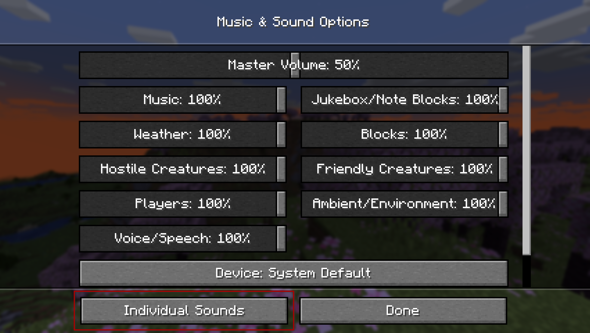
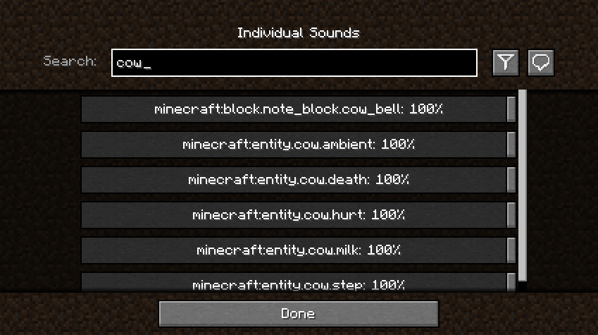

# Sound Controller

We've all dealt with that loud portal before, or those ridiculously loud mob farms. Have you ever wanted to fine-tune just a single sound without needing to change the entire category?

Sound Controller is a fabric mod providing complete volume control over the sounds played in the game. It simply adds an extra button to your sound settings, providing you with a screen full of sound sliders.

By utilising the minecraft registry, this mod should also include all other sounds added to the game by your favourite mods.

This mod is available on [GitHub](https://www.github.com/BVengo/sound-controller), [CurseForge](https://www.curseforge.com/minecraft/mc-mods/sound-controller), and [Modrinth](https://www.modrinth.com/mod/sound-controller).

---

## Features
- A search bar to quickly find the sound you're looking for
- A toggle that filters to your modified volumes, so you can easily find the sounds you've changed
- A toggle that replaces vanilla subtitles with sound ids, so you can identify the name of that pesky noise nearby
- Sliders for every sound in the game, including those added by mods
- A button for every slider that will play the sound at the volume you've set

When using the final feature, it may be hard to hear your sound around all the other game sounds. The easiest place to use it is directly from the menu, however you may want to temporarily disable the `minecraft:music.menu` too!

---

## Images

 

---

## Contributing
Contributions and suggestions are always welcome! Please limit all issues to only one feature at a time - feel free to open multiple at once if you have many ideas. Similarly, please limit pull requests to a single feature at a time and try to follow the existing code style.

To further discuss or get notifications of new updates, check out my [Discord](https://discord.com/invite/kUhf3WSSfv). If you like what I do, consider supporting me on Ko-Fi! 
