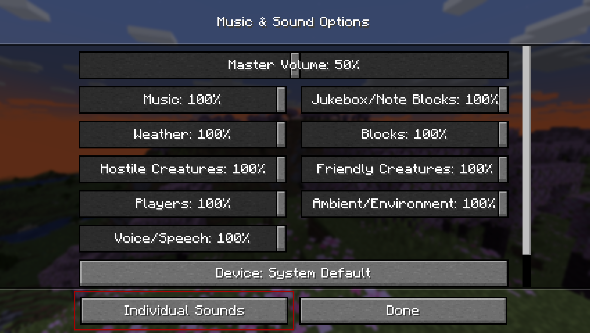
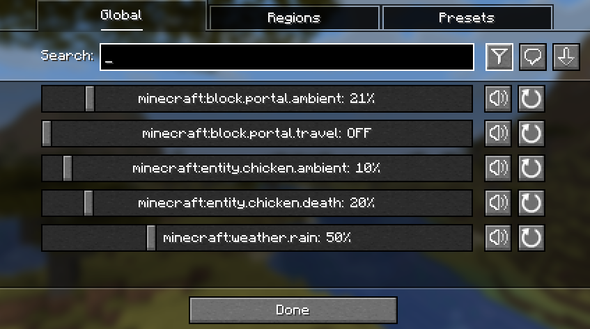
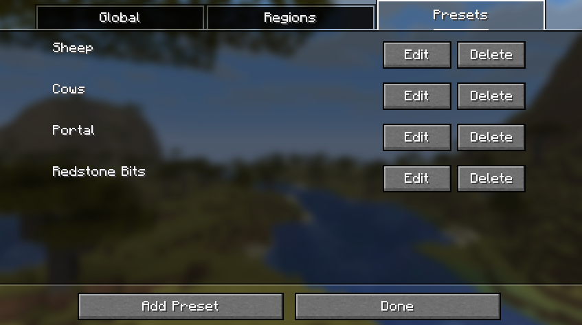
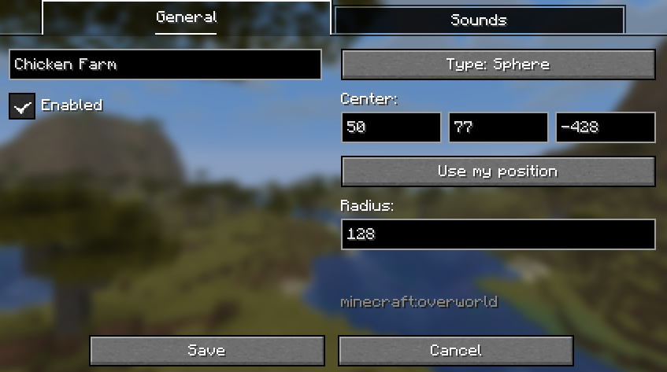
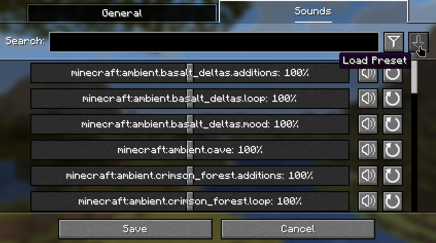

# Sound Controller

We've all dealt with that loud portal before, or those ridiculously loud mob farms. Perhaps you're even listening out for a particular mob while caving. Have you ever wanted to just fine-tune those specific sounds without being limited by the category sliders?

Sound Controller is a client-side Minecraft mod providing complete volume control over the sounds played in the game. It adds an extra set of options to your sound settings, providing you with per-sound volume sliders, custom regions, and presets!

This mod is available on [GitHub](https://www.github.com/BVengo/sound-controller) and [Modrinth](https://www.modrinth.com/mod/sound-controller). Support for [CurseForge](https://www.curseforge.com/minecraft/mc-mods/sound-controller) has been dropped, but very early Fabric versions can still be found there.

---

## Features
- **Sliders** for every sound in the game, including those added by mods. Allows setting volumes between 0% to 200%.
- **Preview** and reset buttons accompanying the volume sliders.
- **Search** to quickly find the sound you're looking for.
- **Filter** to your modified volumes, so you can easily find the sounds you've changed.
- **Identify** noises nearby by replacing the vanilla subtitles with sound IDs (toggleable).
- **Regions**, so that not all of your volume changes need to be global!
- **Presets** that can be applied on top of all your volume configurations. Mute the chickens once, and then apply to all your chicken farms!
- **Mod and datapack support** - your sounds should all be available!

**A note on configs** \
Global volumes and presets are shared across all servers. Regions are stored and loaded per-server

---

## Images

The mod injects an 'Individual Sounds' button into the default sound options screen for quick and easy access. Alternatively, it can be accessed via ModMenu or NeoForge's mods list.

 

The global tab is where you can set the volumes for all sounds in the game no matter where you are or which server you are on, for a consistent playing experience.

 

The presets tab displays all of the preset configurations that can be applied on top of your global or regional volume lists. Note that this doesn't replace the list, so you can apply multiple presets at once!

 

In the region screen, you can pick from two types of geometry. The box region is defined by two diagonally opposing coordinates. The spherical region is defined by a single point and a distance from that point.

 

Below is the button used to apply a preset to the current volume configuration.

---

## Contributing
Contributions and suggestions are always welcome! Please limit all issues to only one feature at a time - feel free to open multiple at once if you have many ideas. Similarly, please limit pull requests to a single feature at a time and try to follow the existing code style.

To further discuss or get notifications of new updates, check out my [Discord](https://discord.gg/gyTa5v7kKk). If you like what I do, consider supporting me on Ko-Fi!

