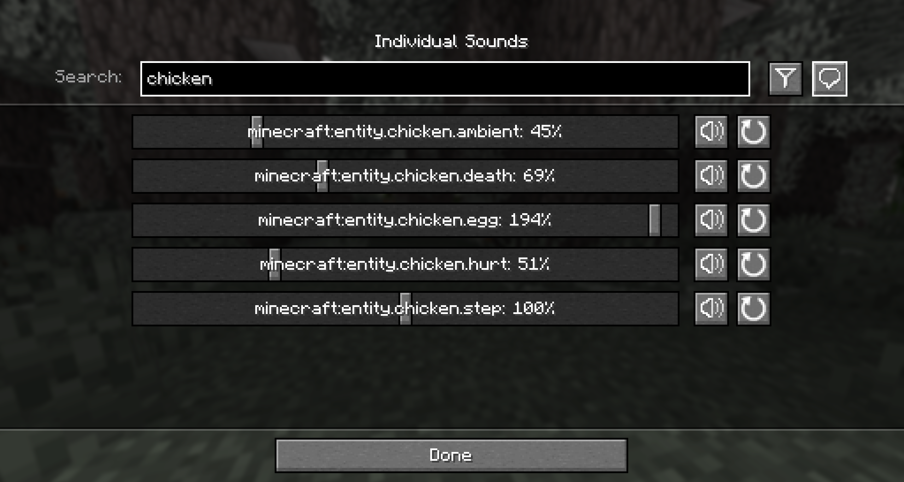

# Sound Controller

We've all dealt with that loud portal before, or those ridiculously loud mob farms. Have you ever wanted to fine-tune just a single sound without needing to change the entire category?

Sound Controller is a fabric mod providing complete control over the sounds played in the game. It simply adds an extra button to your sound settings, providing you with a screen full of sound sliders.

By utilising the minecraft registry, this mod should also include all other sounds added to the game by your favourite mods.

This mod is available on [GitHub](https://www.github.com/BVengo/sound-controller), [CurseForge](https://www.curseforge.com/minecraft/mc-mods/sound-controller), and [Modrinth](https://www.modrinth.com/mod/sound-controller).

 

---

 

## Images

 
 

 

---

 

## Support me!

If you enjoy what I do, then please consider supporting me. It really helps me to put time into maintaining these projects. Thanks!
